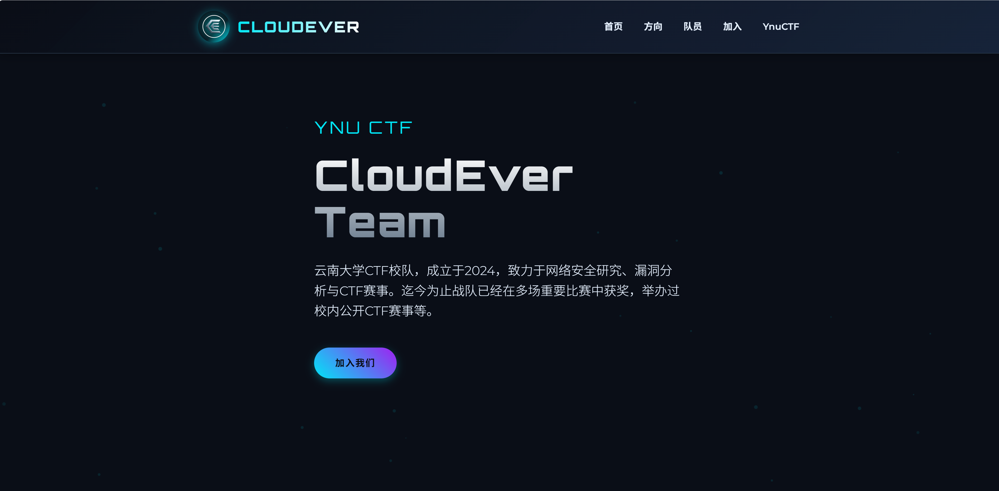
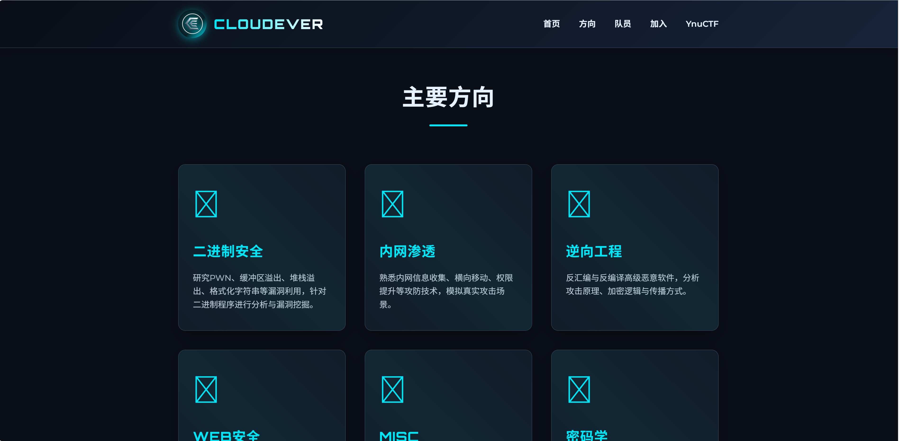
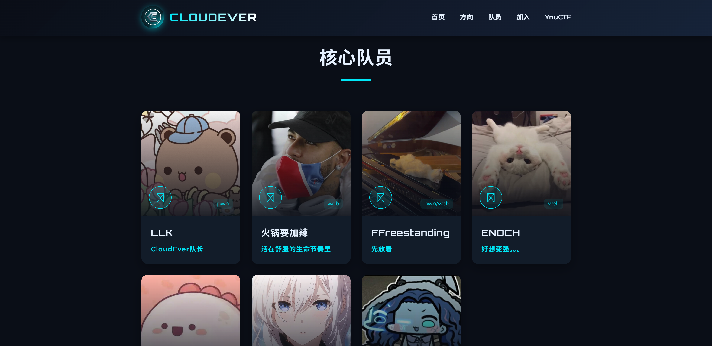
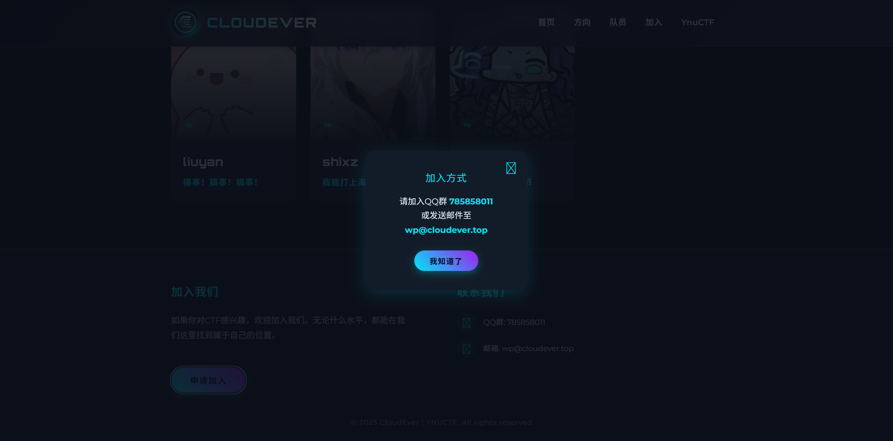

# CloudEver CTF 战队官网

<div align="center">
  
</div>

---

## 🌌 战队简介

云南大学CTF校队，成立于2024，致力于网络安全研究、漏洞分析与CTF赛事。迄今为止战队已经在多场重要比赛中获奖，举办过校内公开CTF赛事等。  
本仓库是战队官网源码，一个**纯前端**打造的 CTF 战队主页，主打极致科技感与简约黑灰配色。  
页面动画流畅，UI 设计帅气，适合展示战队风采、成员介绍及方向领域。

- **官网地址**：[https://cloudever.top](https://cloudever.top)
- **前端技术**：HTML + CSS + JS（无后端依赖）
- **亮点**：
  - 动态粒子背景与平滑滚动动画
  - 响应式设计，移动端友好
  - 极简黑白灰配色，突出战队科技氛围
  - 帅气的字体与图标，极具未来感

---

## 📸 预览截图

<div align="center">
  
  <br>
  
  
</div>

---

## 🏆 主要功能

- **首页**：战队LOGO、简介、动态粒子背景
- **方向**：展示战队擅长的安全领域
- **队员**：核心成员介绍，支持外链个人主页
- **加入我们**：一键弹窗，展示联系方式与加入方式
- **动画效果**：页面滚动、卡片浮现、粒子漂浮等

---

## 💻 目录结构

```
cloudever.top/
├── css/           # 样式文件
├── images/
│   │── demo/      # 预览截图
│   └── user/      # 用户头像
├── index.html     # 主页
└── README.md      # 项目说明
```

---

<div align="center" style="color: #888;">
  &copy; 2025 CloudEver CTF Team. All rights reserved.
</div>